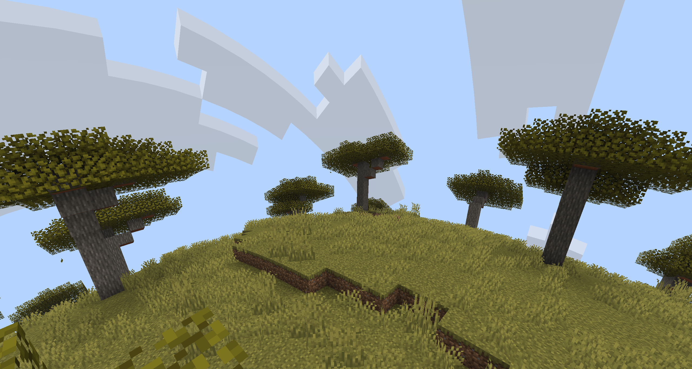
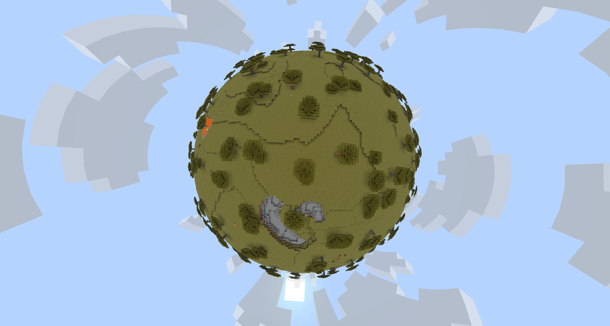
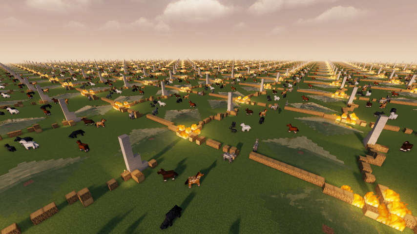
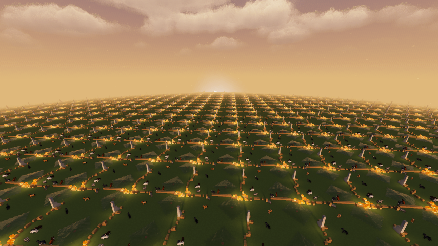

# Globe World

  
  
  
  

Globe World is a Fabric mod for **Minecraft 26.1.2**

This mod adds a finite world that seamlessly tiles, giving the illusion of a globe. Gameplay systems work across tile borders, mob tracking, redstone, seamless terrain, generated structures and more.

You'll find a globe settings tab when creating a world and settings can be adjusted in the pause menu options. The shader packs are not required.

## Features:
- A finite Overworld from as small as two chunks 
- A Nether to match with configurable portal distance ratio
- A built-in shader that allows you to add curvature to your world
- Adjustable day length and realistic day night cycles

## Compatibility:
- Distant horizons should work fine, but it is not aware of this mod so it will do unnecessary work. For worlds where it is useful disable globe world curvature and use distant horizons curvature instead
- Sodium will work fine but breaks the built-in curved-terrain shader. If you use Sodium and want Globe World curvature, install Iris and one optional curvature shader pack below.
    - Terrain is being culled by Sodium’s vertical render-distance limit when the camera is high above the world, there is a fix for this that will only apply to version 0.8.12+mc26.1.2 

## Shader packs:
The shader packs are optional Sodium/Iris compatibility downloads. You do not
need them to use the Fabric mod, seamless wrapping, world generation, commands,
or the built-in non-Sodium curvature path. Download only if you are using
Sodium/Iris and want Globe World curvature.

- globe-world optional curvature shaderpack - a simple Iris shader pack that
  only adds Globe World curvature and matching fog behavior.
- makeup ultra fast globe world optional curvature shaderpack - MakeUp Ultra
  Fast with patched-in Globe World curvature support.

### Debug visuals
- `F3+Y`: toggles the Globe World debug overlay and tile-border renderer.

## Downloads

Published builds are attached to [GitHub Releases](../../releases):

- `globe-world-fabric-mod-mc26.1.2-VERSION.jar`: the required Fabric mod.
- `globe-world-optional-curvature-shaderpack-mc26.1.2-VERSION.zip`: optional
  minimal Iris shader pack for Sodium/Iris users who want Globe World
  curvature.
- `makeup-ultra-fast-globe-world-optional-curvature-shaderpack-mc26.1.2-VERSION.zip`:
  optional MakeUp Ultra Fast shader pack with Globe World curvature support.
